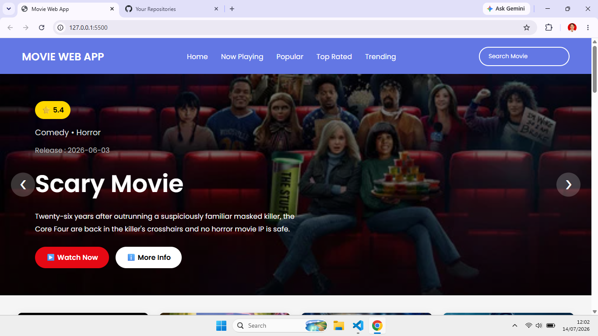
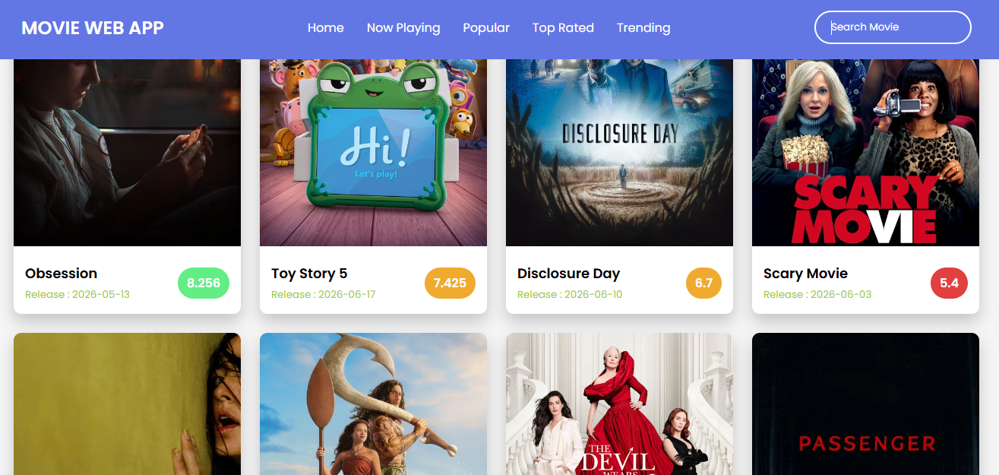
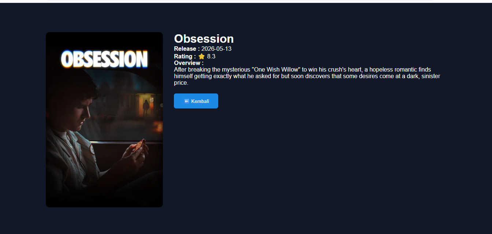
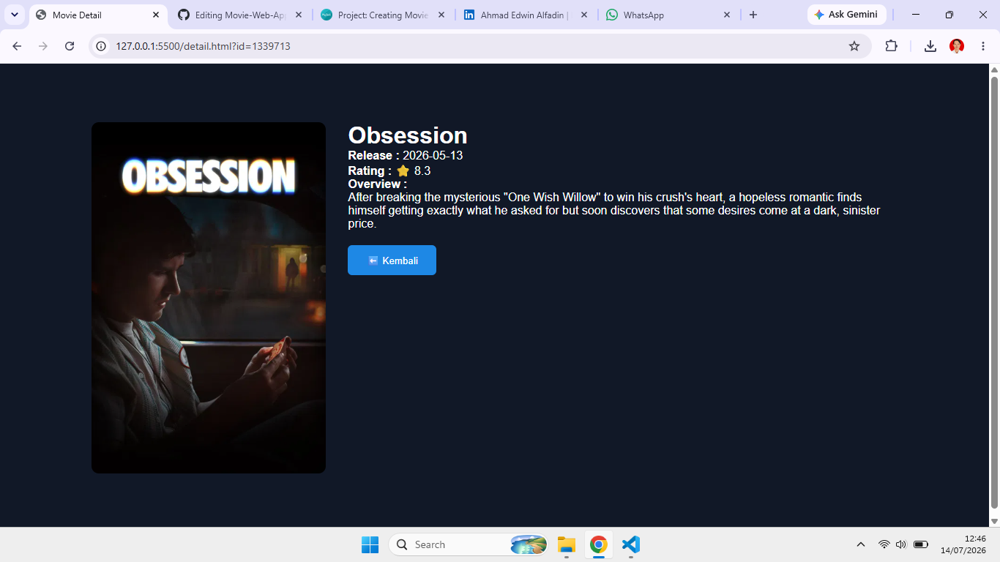

# 🌐 Live Demo

🔗 https://edwinalfadin.github.io/Movie-Web-App/

# 🎬 Movie Web App

A modern Movie Web App built with HTML, CSS, JavaScript, and The Movie Database (TMDB) API.

---

## Tampilan Home

---

## Search Movie

---

## Detail Movie

---

## ✨ Features

- 🏠 Home Page
- 🎞️ Hero Banner
- 🔥 Trending Movies
- 🎬 Now Playing
- ⭐ Top Rated
- ❤️ Popular Movies
- 🔍 Search Movie
- 📄 Movie Detail Page
- ⭐ Rating
- 📅 Release Date
- 🎭 Genre
- 📱 Responsive Design

---

## 🛠️ Technologies

- HTML5
- CSS3
- JavaScript (ES6)
- TMDB API

---

## 📁 Project Structure

Movie-Web-App/
│
├── index.html
├── detail.html
├── style.css
├── detail.css
├── script.js
├── detail.js
├── assets/
└── README.md

---

## 🚀 Installation

Clone repository

bash
git clone https://github.com/EdwinAlfadin/Movie-Web-App.git

Masuk ke folder project

bash
cd Movie-Web-App

Jalankan menggunakan Live Server.

---

## 📸 Screenshot

### Home

### Detail Movie

---

## 🌐 API

Project menggunakan The Movie Database API.

https://www.themoviedb.org/

---

## 🎯 Roadmap

- [x] Movie List
- [x] Search Movie
- [x] Detail Movie
- [x] Hero Banner

---

## 👨‍💻 Author

*Ahmad Edwin Alfadin*

GitHub:
https://github.com/EdwinAlfadin

LinkedIn:
https://linkedin.com/in/ahmad-edwin-alfadin-alfa
